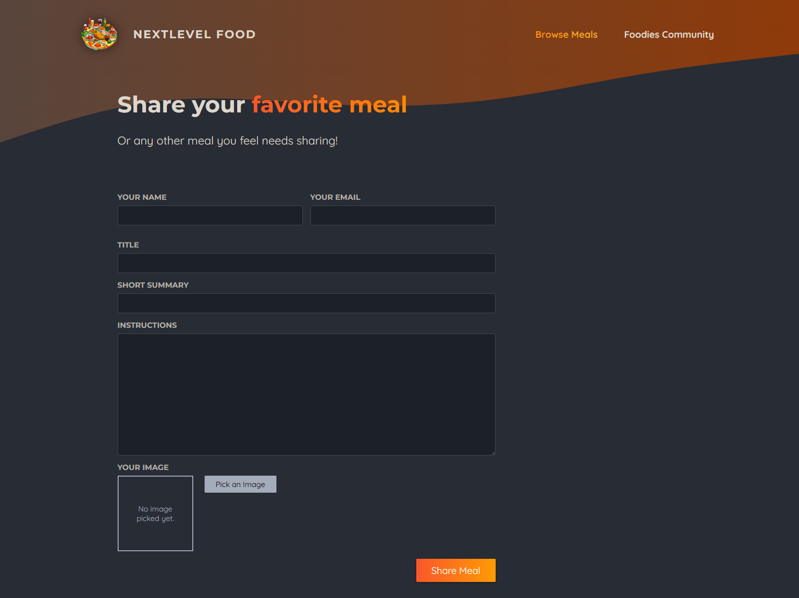

## 🚀 Getting Started

To start the development server, run one of the following commands:

```bash
npm run dev
# or
yarn dev
# or
pnpm dev
# or
bun dev
```

## 🛢️ Initialize the database

```bash
node initdb.js
```


## 📸 App Screenshots

| Home Page | 
| --- | 
|  | 

| Meals Page | 
| --- | 
|  | 

| Meals Page | 
| --- | 
|  | 

| Meal Detail Page | 
| --- | 
|  | 

| Add Meal Page | 
| --- | 
|  | 

| Community Page | 
| --- | 
|  | 
